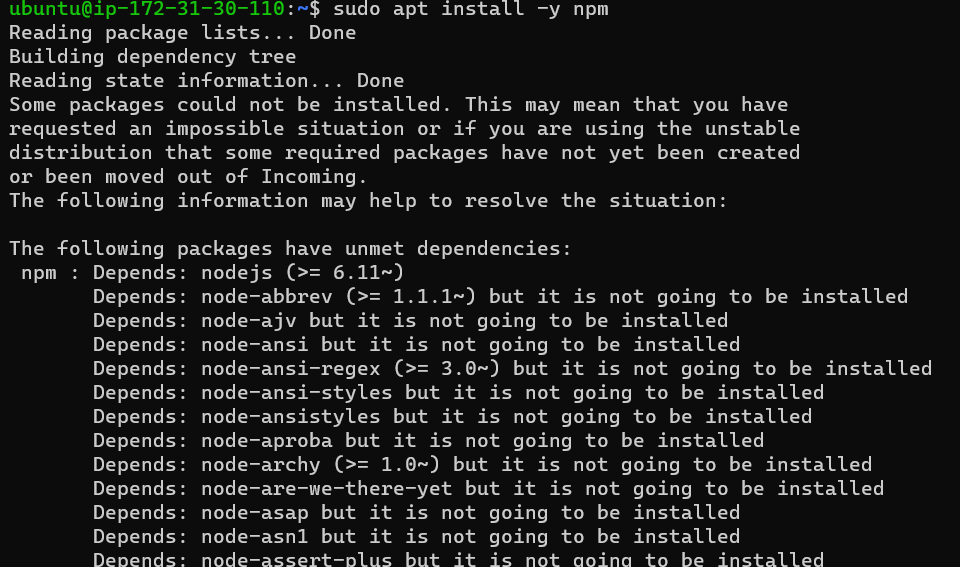
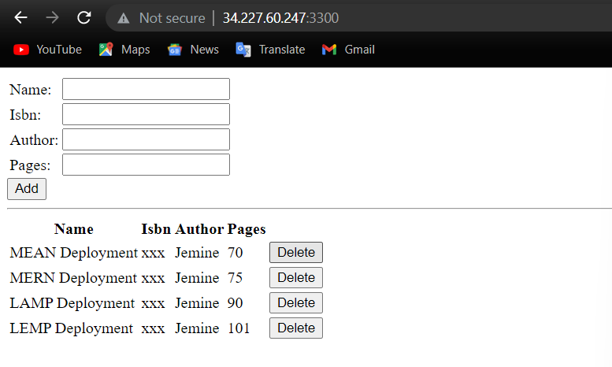

# Project 4 - MEAN Stack Deployment

**Step 1 - Install NodeJS**
---

- First step is installing Node.js which will be used to set up the Express routes and Angular controllers. Before that we need to update & upgrade ubuntu. This is done by `sudo apt update` & `sudo apt upgrade` respectively.

    - Installed curl certificates by running the below command
    ```
    sudo apt -y install curl dirmngr apt-transport-https lsb-release 
    ca-certificates
    curl -sL https://deb.nodesource.com/setup_12.x | sudo -E bash -
    ```

    - Ran the NodeJS installation with `sudo apt install -y nodejs`

**Step 2 - Install MongoDB**

- Would need to use apt-key to authenticate and trust the mongoDB packages that would be installed.

    - Ran `sudo apt-key adv --keyserver hkp://keyserver.ubuntu.com:80 --recv 0C49F3730359A14518585931BC711F9BA15703C6`.

    - Ran `echo "deb [ arch=amd64 ] https://repo.mongodb.org/apt/ubuntu trusty/mongodb-org/3.4 multiverse" | sudo tee /etc/apt/sources.list.d/mongodb-org-3.4.list`.

    - Finally installed MongoDB by running `sudo apt install -y mongodb`

- Started the server & verified the service was running by running `sudo apt install -y mongodb` & `sudo systemctl status mongodb`.


- Ran `sudo apt install -y npm` to install npm the node package manager.

    - Ran into a dependency error when running the above code.
    

    - Did research and went with the recommmendation to install npm using aptitude (another package manager). Installed aptitude first by running `sudo apt install aptitude` & installed npm by running `sudo aptitude install npm`.
    

- Installed the `body-parser` package to help process JSON files passed in requests to the server. This was done by `sudo npm install body-parser`.

***Ignore the warnings above as they are misleading and can lead you to think the package wasn't installed***

- Created and initialized npm in the Books folder for the project `mkdir Books && cd Books` & `npm init`.

- Created a server.js file in the Books dir and pasted the below config into the file.
```
var express = require('express');
var bodyParser = require('body-parser');
var app = express();
app.use(express.static(__dirname + '/public'));
app.use(bodyParser.json());
require('./apps/routes')(app);
app.set('port', 3300);
app.listen(app.get('port'), function() {
console.log('Server up: http://localhost:' + app.get('port'));
});
```

**Step 3 - Installing Express and setting up routes to the server**

- Installed Express (framework) & Mongoose (schema) for the server by running `sudo npm install express mongoose`.

- Created a new dir in /Books called apps and created a file inside /apps named `routes.js` to hold the config for routes. Pasted the config below into routes.
```
var Book = require('./models/book');
module.exports = function(app) {
  app.get('/book', function(req, res) {
    Book.find({}, function(err, result) {
      if ( err ) throw err;
      res.json(result);
    });
  }); 
  app.post('/book', function(req, res) {
    var book = new Book( {
      name:req.body.name,
      isbn:req.body.isbn,
      author:req.body.author,
      pages:req.body.pages
    });
    book.save(function(err, result) {
      if ( err ) throw err;
      res.json( {
        message:"Successfully added book",
        book:result
      });
    });
  });
  app.delete("/book/:isbn", function(req, res) {
    Book.findOneAndRemove(req.query, function(err, result) {
      if ( err ) throw err;
      res.json( {
        message: "Successfully deleted the book",
        book: result
      });
    });
  });
  var path = require('path');
  app.get('*', function(req, res) {
    res.sendfile(path.join(__dirname + '/public', 'index.html'));
  });
};
```

- Created a dir called models inside the /apps folder and created the `book.js` file. Pasted the config below into the file.
```
var mongoose = require('mongoose');
var dbHost = 'mongodb://localhost:27017/test';
mongoose.connect(dbHost);
mongoose.connection;
mongoose.set('debug', true);
var bookSchema = mongoose.Schema( {
  name: String,
  isbn: {type: String, index: true},
  author: String,
  pages: Number
});
var Book = mongoose.model('Book', bookSchema);
module.exports = mongoose.model('Book', bookSchema);
```

**Step 4 - Accessing the routes with AngularJS**

- Created a new dir called public inside the /Books dir. Created a new file called `script.js` inside /public and pasted the below code inside of the file for controller connfiguration.
```
var app = angular.module('myApp', []);
app.controller('myCtrl', function($scope, $http) {
  $http( {
    method: 'GET',
    url: '/book'
  }).then(function successCallback(response) {
    $scope.books = response.data;
  }, function errorCallback(response) {
    console.log('Error: ' + response);
  });
  $scope.del_book = function(book) {
    $http( {
      method: 'DELETE',
      url: '/book/:isbn',
      params: {'isbn': book.isbn}
    }).then(function successCallback(response) {
      console.log(response);
    }, function errorCallback(response) {
      console.log('Error: ' + response);
    });
  };
  $scope.add_book = function() {
    var body = '{ "name": "' + $scope.Name + 
    '", "isbn": "' + $scope.Isbn +
    '", "author": "' + $scope.Author + 
    '", "pages": "' + $scope.Pages + '" }';
    $http({
      method: 'POST',
      url: '/book',
      data: body
    }).then(function successCallback(response) {
      console.log(response);
    }, function errorCallback(response) {
      console.log('Error: ' + response);
    });
  };
});
```

- Created another new file called `index.html` inside the /public folder and pasted the below code into the new file.
```
<!doctype html>
<html ng-app="myApp" ng-controller="myCtrl">
  <head>
    <script src="https://ajax.googleapis.com/ajax/libs/angularjs/1.6.4/angular.min.js"></script>
    <script src="script.js"></script>
  </head>
  <body>
    <div>
      <table>
        <tr>
          <td>Name:</td>
          <td><input type="text" ng-model="Name"></td>
        </tr>
        <tr>
          <td>Isbn:</td>
          <td><input type="text" ng-model="Isbn"></td>
        </tr>
        <tr>
          <td>Author:</td>
          <td><input type="text" ng-model="Author"></td>
        </tr>
        <tr>
          <td>Pages:</td>
          <td><input type="number" ng-model="Pages"></td>
        </tr>
      </table>
      <button ng-click="add_book()">Add</button>
    </div>
    <hr>
    <div>
      <table>
        <tr>
          <th>Name</th>
          <th>Isbn</th>
          <th>Author</th>
          <th>Pages</th>

        </tr>
        <tr ng-repeat="book in books">
          <td>{{book.name}}</td>
          <td>{{book.isbn}}</td>
          <td>{{book.author}}</td>
          <td>{{book.pages}}</td>

          <td><input type="button" value="Delete" data-ng-click="del_book(book)"></td>
        </tr>
      </table>
    </div>
  </body>
</html>
```

- Changed back to the /Books dir and started the server by running `node server.js`. This is so because npm was initialized in the /Books dir.

- Headed over to the network security group settings on AWS to open the required port for accessing the app over the internet (3300)


- Tried accessing the app via the web browser using the `<localhost>:3300` format and the app was accessible and fully functional. See below.


    - Also noticed entries reflecting in the backend whenever entries were made.
    

**MEAN Stack Successfully Deployed!**
---

**Note**
- An alternate way of getting IPv4 addresses aside going to check it from the AWS portal can be done by running ` curl -s http://169.254.169.254/latest/meta-data/public-ipv4`. For DNS name, use `curl -s http://169.254.169.254/latest/meta-data/public-hostname`
